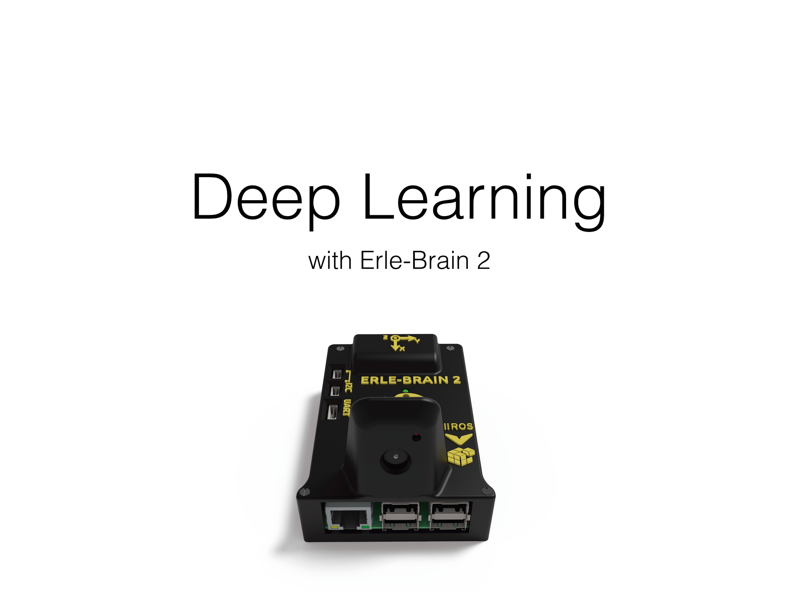
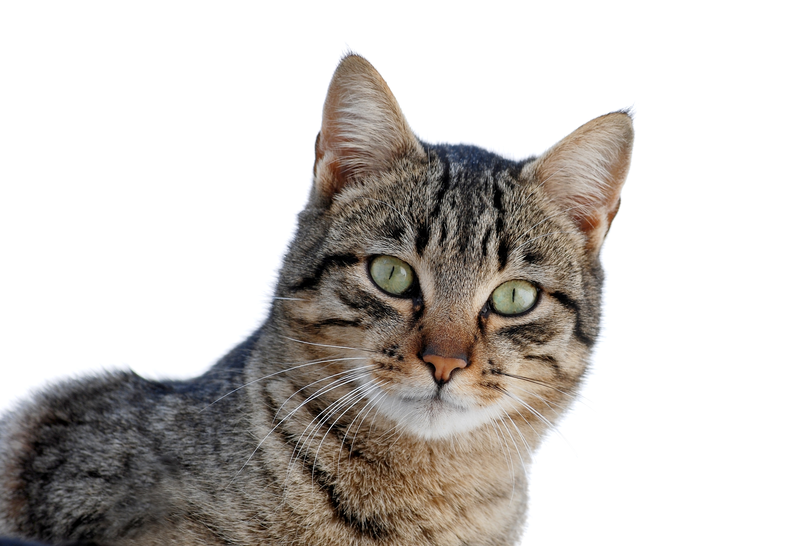

Deep Learning with Erle-Brain 2
====================



This script uses the ImageNet Classification with Deep Convolutional Neural Networks (http://www.cs.toronto.edu/~hinton/absps/imagenet.pdf) implemented and trained at https://github.com/jetpacapp/DeepBeliefSDK to classify objects using a multilayer deep neural network.

### Try it out

#### Install everything
```
# The code assumes you've got an Erle-Brain 2 with an included camera
su; cd /root # get root privileges 
git clone http://github.com/erlerobot/deep-brain-2
cd deep-brain-2
sudo apt-get install -y mercurial
hg clone https://bitbucket.org/eigen/eigen
ln -s /root/deep-brain-2/eigen /root/deep-brain-2/DeepBeliefSDK/eigen
cd /root/deep-brain-2/DeepBeliefSDK/source
make clean
make GEMM=eigen TARGET=pi2
```

#### Use the scripts
- `deep_erle-brain2_camera.sh`: Use the onboard camera in Erle-Brain 2 to clasify whatever it sees.
- `deep_erle-brain2_file.sh`: Provide an img path as the first argument and classify it.
- `deep_erle-brain2_url.sh`: Use a URL to fetch images from the web.

Example:


```
root@erle-brain-2:~/deep-brain-2# ./deep_erle-brain2_file.sh files/cat.jpg 
************************
JPCNN Network with 28 layers
Node ConvNode - conv1 - _kernelWidth=11, _kernelCount=96, _marginSize=0, _sampleStride=4, _kernels->_dims=(96, 363), _bias->_dims=(96, 1)
Node ReluNode - conv1_neuron.1 - 
Node ReluNode - conv1_neuron - 
Node PoolNode - pool1 - _patchWidth=3, _stride=2, _mode=max
Node NormalizeNode - rnorm1 - _windowSize=5, _k=1.000000, _alpha=0.000020, _beta=0.750000
Node GConvNode - conv2 - _kernelsCount = 256, _subnodes = Node ConvNode - conv2 - _kernelWidth=5, _kernelCount=128, _marginSize=2, _sampleStride=1, _kernels->_dims=(128, 1200), _bias->_dims=(128, 1) Node ConvNode - conv2 - _kernelWidth=5, _kernelCount=128, _marginSize=2, _sampleStride=1, _kernels->_dims=(128, 1200), _bias->_dims=(128, 1)
Node ReluNode - conv2_neuron.1 - 
Node ReluNode - conv2_neuron - 
Node PoolNode - pool2 - _patchWidth=3, _stride=2, _mode=max
Node NormalizeNode - rnorm2 - _windowSize=5, _k=1.000000, _alpha=0.000020, _beta=0.750000
Node ConvNode - conv3 - _kernelWidth=3, _kernelCount=384, _marginSize=1, _sampleStride=1, _kernels->_dims=(384, 2304), _bias->_dims=(384, 1)
Node ReluNode - conv3_neuron.1 - 
Node ReluNode - conv3_neuron - 
Node GConvNode - conv4 - _kernelsCount = 384, _subnodes = Node ConvNode - conv4 - _kernelWidth=3, _kernelCount=192, _marginSize=1, _sampleStride=1, _kernels->_dims=(192, 1728), _bias->_dims=(192, 1) Node ConvNode - conv4 - _kernelWidth=3, _kernelCount=192, _marginSize=1, _sampleStride=1, _kernels->_dims=(192, 1728), _bias->_dims=(192, 1)
Node ReluNode - conv4_neuron.1 - 
Node ReluNode - conv4_neuron - 
Node GConvNode - conv5 - _kernelsCount = 256, _subnodes = Node ConvNode - conv5 - _kernelWidth=3, _kernelCount=128, _marginSize=1, _sampleStride=1, _kernels->_dims=(128, 1728), _bias->_dims=(128, 1) Node ConvNode - conv5 - _kernelWidth=3, _kernelCount=128, _marginSize=1, _sampleStride=1, _kernels->_dims=(128, 1728), _bias->_dims=(128, 1)
Node ReluNode - conv5_neuron.1 - 
Node ReluNode - conv5_neuron - 
Node PoolNode - pool5 - _patchWidth=3, _stride=2, _mode=max
Node NeuronNode - fc6 - _outputsCount=4096, _useBias=1, _weights->_dims=(4096, 9216)
Node ReluNode - fc6_neuron.1 - 
Node ReluNode - fc6_neuron - 
Node NeuronNode - fc7 - _outputsCount=4096, _useBias=1, _weights->_dims=(4096, 4096)
Node ReluNode - fc7_neuron.1 - 
Node ReluNode - fc7_neuron - 
Node NeuronNode - fc8 - _outputsCount=999, _useBias=1, _weights->_dims=(999, 4096)
Node MaxNode - probs - 
************************
Classification took 3719 milliseconds
0.201121	Egyptian cat
0.213839	lynx
0.305880	tabby

```

### Sources:
- http://www.cs.toronto.edu/~hinton/absps/imagenet.pdf
- https://github.com/jetpacapp/DeepBeliefSDK
